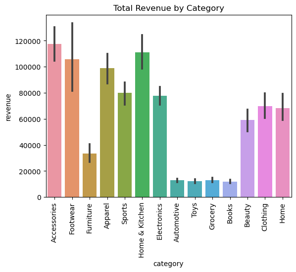

# 🛍️ Retail Sales Data Analysis Project

## What's This About?
Hey there! This is a college project where I work with retail sales data. Basically, I take messy data from different sources (like JSON files, Excel sheets, and CSV files), clean it up, and create some cool visualizations to understand sales patterns.

##  What's in This Folder?

```
Retail_ETL/
├── Readme.md                      # This file you're reading
├── Retail_Dataset_Analysis.ipynb  # The main notebook with all my work
├── retail_sales_1000.json        # Raw data from JSON
├── retail_data_1000.json         # More JSON data
├── retail_sales_dataset.xlsx     # Excel data file
├── retail_sales_1000_2sql.xlsx   # Excel file ready for database
├── retail_sales_dataset_2.csv    # CSV data file
└── Retail_data_final.csv         # Final clean data (this is what we want!)
```

##  About The Data

I'm working with real retail sales data that includes:

- **Store Information**: Which store sold what
- **Product Details**: What was sold and for how much
- **Sales Numbers**: How many items were sold and total revenue
- **Location Data**: Where these stores are located (mostly Indian cities)

### What Each Column Means:
- `store_name`: The name of the store
- `location`: Which city the store is in
- `product_name`: What product was sold
- `category`: Type of product (like shoes, clothes, furniture)
- `price`: How much one item costs
- `units_sold`: How many were sold
- `revenue`: Total money made (price × quantity)

##  How I Process The Data

Think of this like cleaning your room, but for data:

### Step 1: Collect Everything 
- Grab data from JSON files (web-friendly format)
- Load Excel spreadsheets (the classic format)
- Read CSV files (simple comma-separated data)

### Step 2: Clean It Up 
- Remove columns I don't need (like customer IDs that don't help with analysis)
- Make sure all data looks consistent
- Fix any weird formatting issues

### Step 3: Store It Properly 
- Put the clean data into a MySQL database
- Export everything to a nice, clean CSV file for easy sharing

##  Database Setup

I'm using MySQL to store the data. Here's what you need to know:
- Database name: `ETL`
- Table name: `Retail_data`
- Running on: localhost (my computer)

> **Quick tip**: You'll need to change the database password in the notebook to match yours!

##  Cool Charts I Made

I created some fun visualizations to understand the data better:

1. **Product Categories Chart**: Shows which types of products are most common


2. **Price Distribution**: How expensive/cheap products are on average  


3. **Revenue by Category**: Which product types make the most money



These charts help answer questions like "What sells best?" and "Where's the money coming from?"

##  What You Need

### Software:
- Python (version 3.7 or newer)
- Jupyter Notebook (for running the analysis)
- MySQL (for the database)

### Python Libraries:
Just run these commands to install everything:
```bash
pip install pandas sqlalchemy mysql-connector-python seaborn matplotlib openpyxl
```

Don't worry if you haven't used these before - they're just tools that help with data analysis!

##  How To Run This

### Getting Started:
1. **Download everything**: Get all the files in this folder
2. **Install the tools**: Run the pip install command above
3. **Set up MySQL**: Create a database called `ETL` and update the password in the notebook
4. **Open Jupyter**: Type `jupyter notebook` in your terminal
5. **Run the analysis**: Open `Retail_Dataset_Analysis.ipynb` and run all the cells

### What happens when you run it:
1. It reads all the messy data files
2. Cleans everything up
3. Saves clean data to the database
4. Creates the final CSV file
5. Shows you pretty charts!

That's it! You'll end up with clean data and some nice visualizations.

##  What Makes This Cool

- **Works with multiple file types**: JSON, Excel, CSV - I can handle them all!
- **Database integration**: Stores data properly in MySQL
- **Pretty visualizations**: Charts that actually make sense
- **Complete workflow**: From messy data to insights
- **Real-world data**: Actual retail sales information

##  Final Results

After running everything, you get:
- `Retail_data_final.csv`: A super clean dataset with 3,628 sales records
- Beautiful charts showing sales patterns
- Data stored safely in a database

##  What I Discovered

The data is pretty interesting! I found:
- Stores selling different types of products (accessories, shoes, furniture, clothes)
- Sales happening across various Indian cities
- Revenue patterns that show which products are most profitable
- Price ranges that help understand the market

##  About This Project

This was made as part of my college coursework to learn about data processing and analysis. It's been a great way to understand how real businesses work with their sales data!

